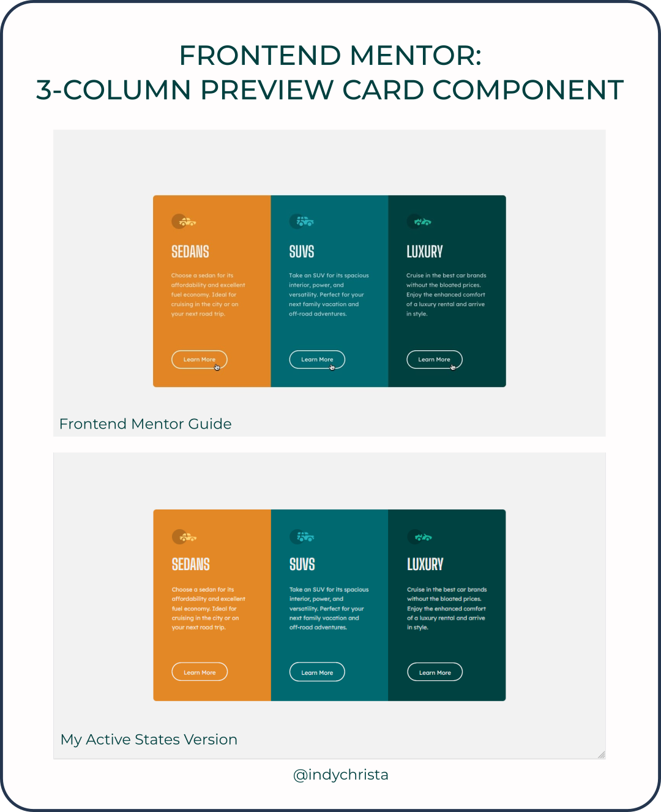

# Frontend Mentor - 3-column preview card component solution

This is a solution to the [3-column preview card component challenge on Frontend Mentor](https://www.frontendmentor.io/challenges/3column-preview-card-component-pH92eAR2-). Frontend Mentor challenges help you improve your coding skills by building realistic projects. 

## 📝Important to Note

Currently, I do not have a Frontend Mentor Pro Account and was not able to download the Figma design files. I did create my own Figma files using the JPG images provided as a guide.

## 🗺️ Table of contents

- [Overview](#🧭-overview)
  - [The challenge](#the-challenge)
  - [Screenshot](#screenshot)
  - [Links](#links)
- [My process](#⚙️-my-process)
  - [Built with](#built-with)
  - [What I learned](#📚-what-i-learned)
  - [Continued development](#🚀-continued-development)
  - [Useful resources](#💰-useful-resources)
- [Author](#👩‍💻-author)
- [Acknowledgments](#😊-acknowledgments)

## 🧭 Overview

### The challenge

Users should be able to:

- View the optimal layout depending on their device's screen size
- See hover states for interactive elements

### Screenshot

### Links

- Solution URL: [https://www.frontendmentor.io/solutions/3column-preview-card-component-z9BvJa-mR6](https://www.frontendmentor.io/solutions/3column-preview-card-component-z9BvJa-mR6)
- Live Site URL: [https://indychrista.github.io/frontend-mentor-repo/3-column-preview-card-component-main/index.html](https://indychrista.github.io/frontend-mentor-repo/3-column-preview-card-component-main/index.html)

## ⚙️ My process

### Built with

- Semantic HTML5 elements
- Sass/scss stylesheets (*See [What I learned](#📚-what-i-learned) notes below!)
- Flexbox
- Mobile-first workflow

### Utilities used

- [Figma](https://www.figma.com) 
- [Visual Studio Code](https://code.visualstudio.com)
- Live Sass Compiler (VScode extension)
- Sass (VScode extension)
- [Github](https://github.com)
- [Github Pages](https://https://pages.github.com/)
- [Inkscape](https://inkscape.org) - screenshot graphics

### 📚 What I learned

Key take-aways from this Frontend Mentor challenge:

-  When you're learning new things, it's seldom pretty. Keep learning, leave your ego at the door, build some things and you'll be a better developer for it in the end.
-  <strong>This was my first completed project using Sass and I fully realize it's a jumbled mess!</strong> I'm ok with this at this point. I tried different concepts on this project as I was watching the first 30 minutes of the freecodecamp sponsored video course (see resources below), so that should explain the odd choices to anyone reviewing my code!
-  Sass is going to take some time to get comfortable with, but I do think it will be worth the effort.  Honestly, I've avoided it for a couple of years, but I've decided to give it a shot. (*See more info on this in the following section below.) 

### 🚀 Continued development

-  I will be continuing with the freecodecamp sponsored Sass video course mentioned in the resources below and plan to use what I learn in the coming Frontend Mentor projects as well as projects for the [freecodecamp.org Frontend Development Libraries Certification](https://freecodecamp.org/learn/front-end-development-libraries/).

### 💰 Useful resources

- [Install Sass](https://sass-lang.com/install) - If you're using Node.js, ``npm install -g sass``from the command line will get you where you're going, or visit this link for other options and info.
- [Sass Basics](https://sass-lang.com/guide) -New to Sass like me? Don't miss this overview!
- [Sass Tutorial for Beginners - CSS With Superpowers](https://youtu.be/_a5j7KoflTs) - This 2-hour video course featured on freecodecamp.org's YouTube channel was a great help with setting up my scss file structure and getting rolling with adding Sass to my project. FYI...This project was completed with info from the first 30 minutes, but I will be continuing with the full course.
- [freecodecamp.org | Front End Development Libraries (SASS section)](https://freecodecamp.org/learn/front-end-development-libraries/)
- [Codecademy | Semantic HTML](https://codecademy.com/learn/learn-html/modules/learn-semantic-html/cheatsheet) - This Codecademy cheatsheet is a clear, simple, concise and beginner-friendly guide to basic semantic HTML elements.
-[w3 schools | HTML Semantic Elements](https://w3schools.com/html/html5_semantic_elements.asp) For a deeper dive into semantic HTML5, I highly recommend this resource.

## 👩‍💻 Author

- Website - [Christa DeJesus | Frontend Mentor Projects](https://indychrista.github.io/frontend-mentor-repo/)
- Frontend Mentor - [@indychrista](https://www.frontendmentor.io/profile/indychrista)
- Github - [indychrista.github.io](https://indychrista.github.io)

## 😊 Acknowledgments

Thank you in advance to anyone taking time to view this project and for any constructive feedback offered!

I also want to thank all of the resources I mentioned above for offering free, quality, and easily accessible content for the development community. Your time and hard work is appreciated!
