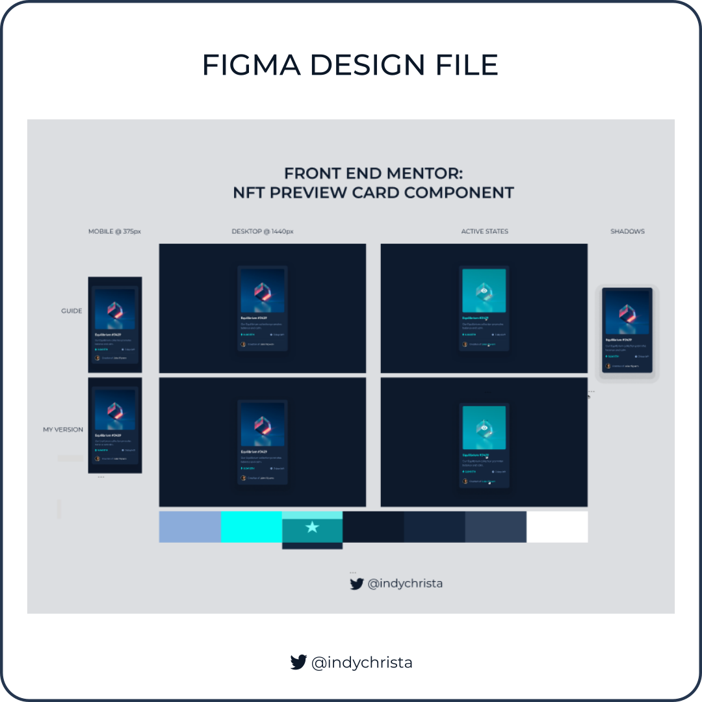
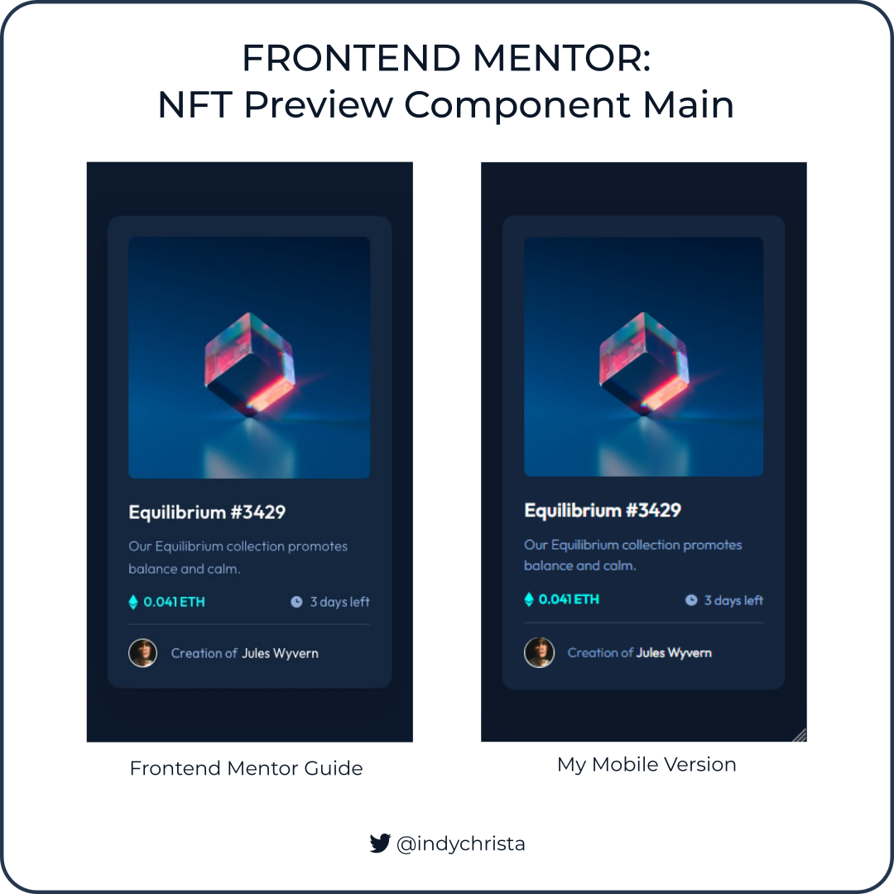
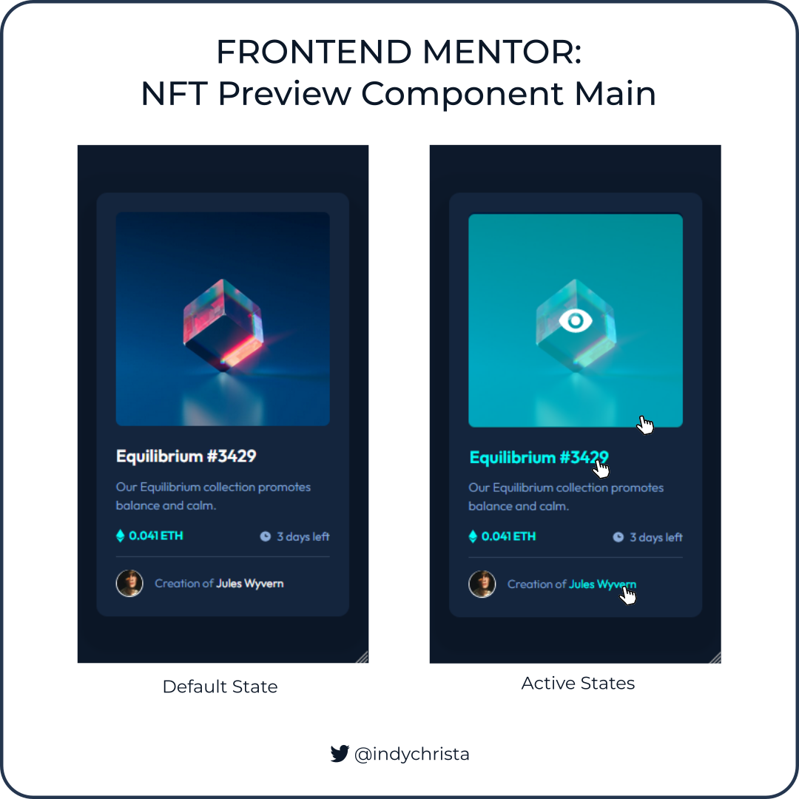
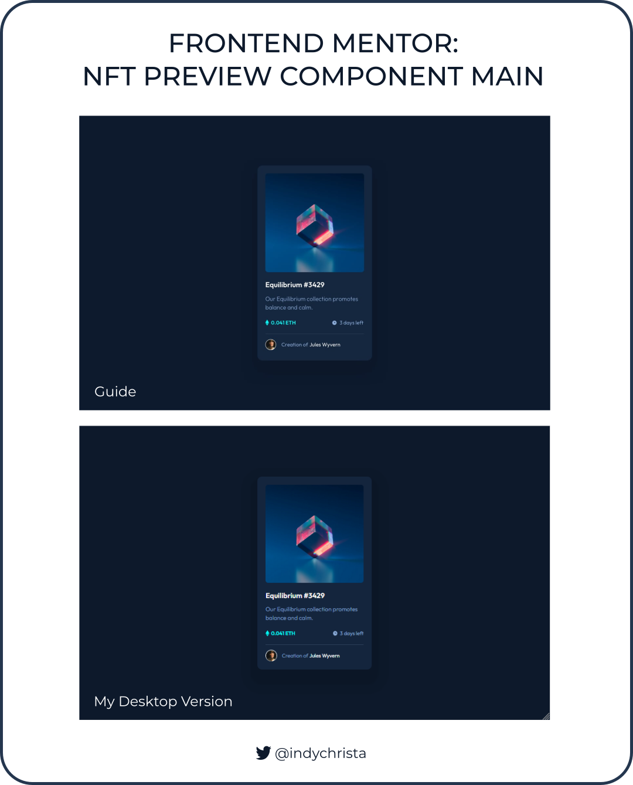

# Frontend Mentor - NFT preview card component solution

This is a solution to the [NFT preview card component challenge on Frontend Mentor](https://www.frontendmentor.io/challenges/nft-preview-card-component-SbdUL_w0U). Frontend Mentor challenges help you improve your coding skills by building realistic projects. 

## 📝Important to Note

Currently, I do not have a Frontend Mentor Pro Account and was not able to download the Figma design files. I did create my own Figma files using the JPG images provided as a guide.

## 🗺️ Table of contents

- [Overview](#overview)
  - [The challenge](#the-challenge)
  - [Screenshot-comparison](#screenshot-comparison)
  - [Links](#links)
- [My process](#my-process)
  - [Built with](#built-with)
  - [Utilities used](#utilities-used)
  - [What I learned](#what-i-learned)
  - [Continued development](#continued-development)
  - [Useful resources](#useful-resources)
- [Author](#author)
- [Acknowledgments](#acknowledgments)

## 🧭 Overview

### The challenge

Users should be able to:

- View the optimal layout depending on their device's screen size
- See hover states for interactive elements

### Screenshot Comparison

 

### Links

- Solution URL: [https://www.frontendmentor.io/solutions/nft-preview-card-component-using-flexbox-foZ9_sUAP2](https://www.frontendmentor.io/solutions/nft-preview-card-component-using-flexbox-foZ9_sUAP2)
- Live Site URL: [https://indychrista.github.io/frontend-mentor-repo/nft-preview-card-component-main/index.html](https://indychrista.github.io/frontend-mentor-repo/nft-preview-card-component-main/index.html)

## ⚙️ My process

### Built with

- HTML/CSS
- CSS custom properties
- Mobile-first workflow

### Utilities used

- [Figma](https://www.figma.com) 
- [Visual Studio Code](https://code.visualstudio.com)
- [Github](https://github.com)
- [Github Pages](https://https://pages.github.com/)
- [Inkscape](https://inkscape.org) - screenshot graphics

### 📚 What I learned

Key take-aways from this Frontend Mentor challenge:
 -  Always start development of Frontend Mentor projects using Firefox web browser and developer tools and then cross-browser test using Chrome, etc. This will increase design accuracy when compared with their design screenshot and help identify code that may be incompatible across browsers early in the development process.
 - You cannot hover over an element set to "display: none" or "visibility: hidden". I solved this problem by altering the opacity of a feature image overlay when hovered, although there are some bugs on mobile. I plan to revisit this problem in the future, so I welcome any ideas!

### 🚀 Continued development

A few areas I plan to continue working on in future Frontend Mentor projects:

- Explore Firefox web browser, developer tools, and other Mozilla products
- Map out design and development process and explore options to better track workflow
- Seek out and offer project feedback 

### 💰 Useful resources

- [Mozilla.org](https://mozilla.org) - Learn about the Firefox web browser and a host of other open source Mozilla products.

## 👩‍💻 Author

- Website - [Christa DeJesus | Frontend Mentor Projects](https://indychrista.github.io/frontend-mentor-repo/)
- Frontend Mentor - [@indychrista](https://www.frontendmentor.io/profile/indychrista)
- Github - [indychrista.github.io](https://indychrista.github.io)

## 😊 Acknowledgments

Thank you in advance to anyone taking time to view this project and for any constructive feedback offered! 
