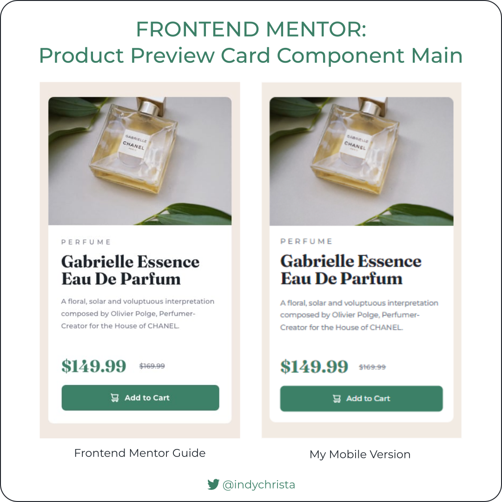
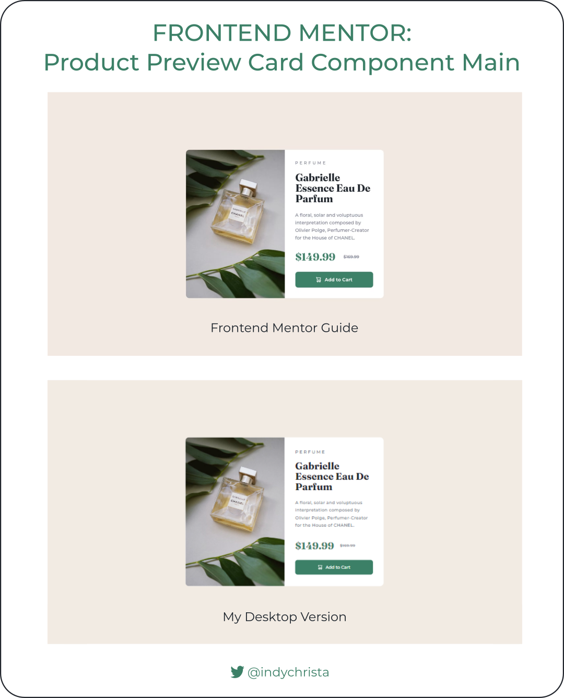
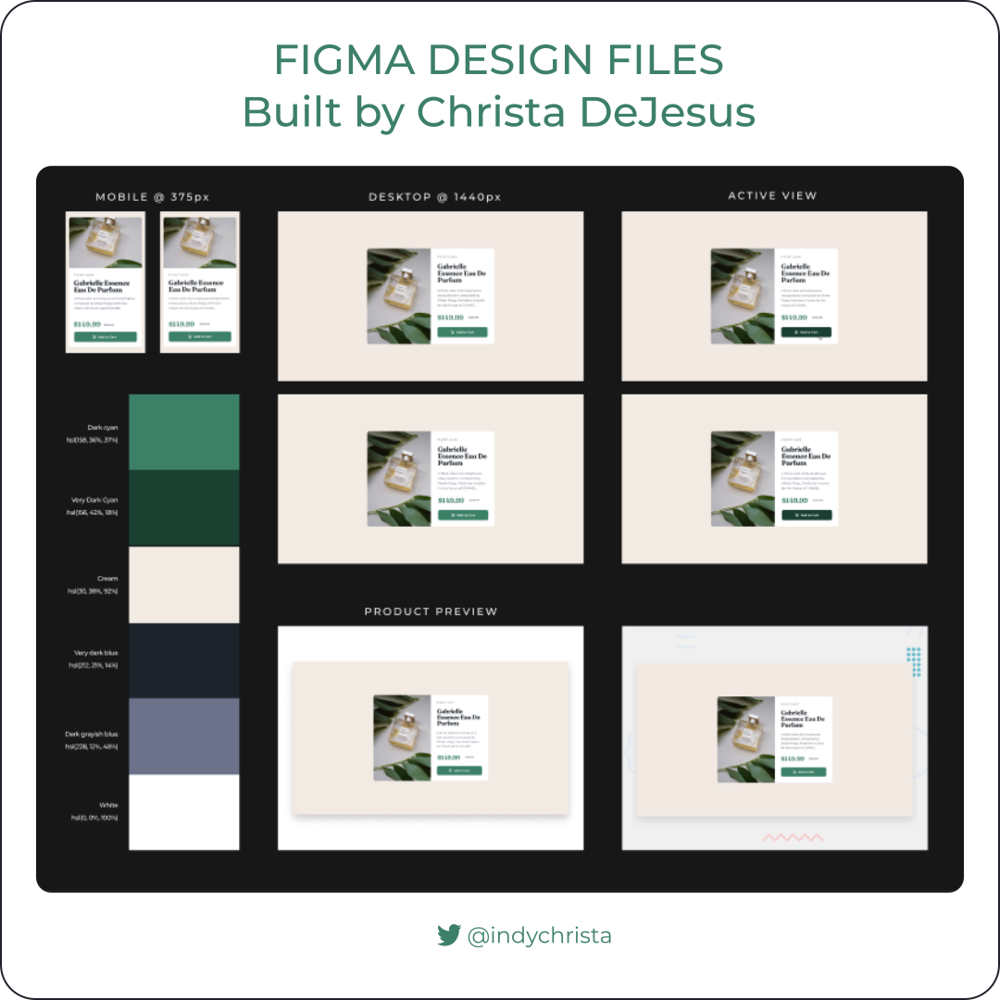

# Frontend Mentor - Product Preview Card Component Solution

This is my solution to the [Product preview card component challenge on Frontend Mentor](https://www.frontendmentor.io/challenges/product-preview-card-component-GO7UmttRfa). Frontend Mentor challenges help you improve your coding skills by building realistic projects. 

## 📝Important to Note

Currently, I do not have a Frontend Mentor Pro Account and was not able to download the Figma design files. 

Images shown below represent Figma design files I created from scratch using the JPG static design images provided by Frontend Mentor as a guide.

## 🗺️ Table of contents

- [Overview](#overview)
  - [The challenge](#the-challenge)
  - [Screenshot Comparison](#screenshot-comparison)
  - [Links](#links)
- [My process](#my-process)
  - [Built with](#built-with)
  - [Utilities used](#utilities-used)
  - [What I learned](#what-i-learned)
  - [Continued development](#continued-development)
  - [Useful resources](#useful-resources)
- [Author](#author)
- [Acknowledgments](#acknowledgments)

## 🧭Overview

### The challenge

Users should be able to:

- View the optimal layout depending on their device's screen size
- See hover and focus states for interactive elements

### Screenshot Comparison

### Links

Will update when submitted!

- Solution URL: [Add solution URL here](https://your-solution-url.com)
- Live Site URL: [https://indychrista.github.io/frontend-mentor-repo/](https://indychrista.github.io/frontend-mentor-repo/)
- Repository URL: [https://github.com/indychrista/frontend-mentor-repo/tree/main/product-preview-card-component-main](https://github.com/indychrista/frontend-mentor-repo/tree/main/product-preview-card-component-main)

## ⚙️ My process

### Built with

- Semantic HTML5 markup
- CSS custom properties
- Flexbox
- Mobile-first workflow

### Utilities used
  
- [Figma](https://www.figma.com) 
- [Visual Studio Code](https://code.visualstudio.com)
- [Github](https://github.com)
- [Github Pages](https://https://pages.github.com/)
- [Inkscape](https://inkscape.org) - screenshot graphics

### 📚 What I learned 

Will update after I submit this project!

### 🚀 Continued development 

A few areas I plan to continue working on in future Frontend Mentor projects:

- Become more familiar with the Frontend Mentor platform, submission process, and community
- Increase design and development workflow efficiency (considering Frontend Mentor Pro Account to work from provided Figma design files)
- Seek out and build upon project feedback received from the Frontend Mentor and development community

### 💰 Useful resources 

- ["Complete guide to submitting solutions"](https://medium.com/frontend-mentor/a-complete-guide-to-submitting-solutions-on-frontend-mentor-ac6384162248) - Visit this site for tips on how to submit your solutions to share with the Frontend Mentor community.
- [W3schools.io | Markdown - Table](https://www.w3schools.io/file/markdown-table/) - This helpful guide was used to create Markdown tables in my main [Frontend Mentor repository](../README.md).
- [StackOverflow | Changing image size in Markdown](https://stackoverflow/questions/14675913/changing-image-size-in-markdown) - The comments found here helped me to keep my screenshot images above from getting too large and maintain some basic responsiveness.

## 👩‍💻 Author 

- Website - [Christa DeJesus | Frontend Mentor Projects](https://indychrista.github.io/frontend-mentor-repo/)
- Frontend Mentor - [@indychrista](https://www.frontendmentor.io/profile/indychrista)
- Twitter - [@indychrista](https://www.twitter.com/indychrista)

## 😊 Acknowledgments 

Thank you in advance to anyone taking time to view this project and for any constructive feedback offered! 