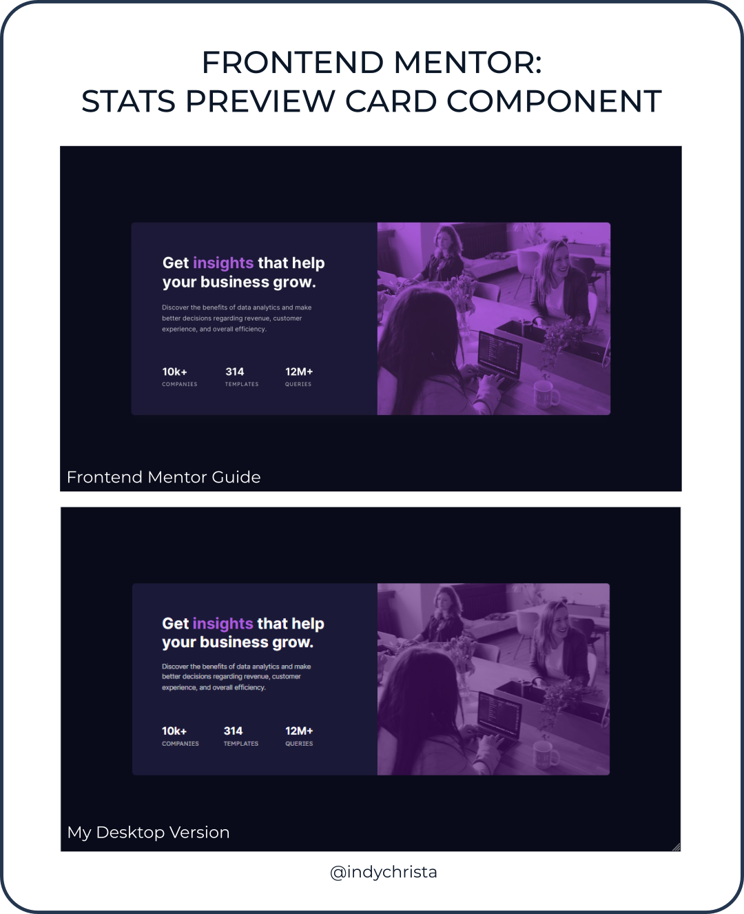

# Frontend Mentor - Stats preview card component solution

This is a solution to the [Stats preview card component challenge on Frontend Mentor](https://www.frontendmentor.io/challenges/stats-preview-card-component-8JqbgoU62). Frontend Mentor challenges help you improve your coding skills by building realistic projects. 

## 📝Important to Note

Currently, I do not have a Frontend Mentor Pro Account and was not able to download the Figma design files. I did create my own Figma files using the JPG images provided as a guide.

## 🗺️ Table of contents

- [Overview](#overview)
  - [The challenge](#the-challenge)
  - [Screenshot](#screenshot)
  - [Links](#links)
- [My process](#my-process)
  - [Built with](#built-with)
  - [What I learned](#what-i-learned)
  - [Continued development](#continued-development)
  - [Useful resources](#useful-resources)
- [Author](#author)
- [Acknowledgments](#acknowledgments)

## 🧭 Overview

### The challenge

Users should be able to:

- View the optimal layout depending on their device's screen size

### Screenshot

### Links

- Solution URL: [https://www.frontendmentor.io/solutions/stats-preview-card-component-TEWDrZ7sBw](https://www.frontendmentor.io/solutions/stats-preview-card-component-TEWDrZ7sBw)
- Live Site URL: [https://indychrista.github.io/frontend-mentor-repo/stats-preview-card-component-main/index.html](https://indychrista.github.io/frontend-mentor-repo/stats-preview-card-component-main/index.html)

## ⚙️ My process

### Built with

- HTML
- CSS custom properties
- Flexbox
- Mobile-first workflow

### Utilities used

- [Figma](https://www.figma.com) 
- [Visual Studio Code](https://code.visualstudio.com)
- [Github](https://github.com)
- [Github Pages](https://https://pages.github.com/)
- [Inkscape](https://inkscape.org) - screenshot graphics

### 📚 What I learned

Key take-aways from this Frontend Mentor challenge:

-  Using the ``<picture>`` element allows you to assign images based on the display/device right in your HTML.
-  The ::before and ::after psuedo elements can be used for a variety of design/decorative needs. However, they should not be used for actual non-decorative content because the "content" they create is not compatible with accessibility technology.
-  There are a million ways to code any project. Just keep trying new avenues, learning best practices, and applying what you learn to see how it all comes together to solve a particular problem. Maybe the strategy you choose won't be the best solution for this challenge, but you might just learn something that will help you find the best solution for the next one!  

### 🚀 Continued development

- For this next round, I've decided to push myself to try something new with HTML and CSS. We'll see where that strategy takes me!

### 💰 Useful resources

- [mdn web docs | picture: The Picture element](https://developer.mozilla.org/en-US/docs/Web/HTML/Element/picture) - This project was my first using the picture element to offer alternative images based on display/device. If this is new to you, too, the Mozilla Developer docs will get you started!
- [CSS-TRICKS | 7 Practical Uses for the ::before and ::after Pseudo-Elements in CSS](https://css-tricks.com/7-practical-uses-for-the-before-and-after-pseudo-elements-in-css/) - If you're struggling to grasp the use of the before and after pseudo elements, this is a great article full of examples to explore. 

## 👩‍💻 Author

- Website - [Christa DeJesus | Frontend Mentor Projects](https://indychrista.github.io/frontend-mentor-repo/)
- Frontend Mentor - [@indychrista](https://www.frontendmentor.io/profile/indychrista)
- Github - [indychrista.github.io](https://indychrista.github.io)

## 😊 Acknowledgments

Thank you in advance to anyone taking time to view this project and for any constructive feedback offered!
